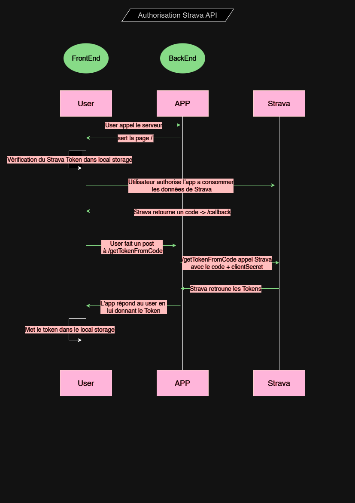

# Rest_SPA
### TP 1 | Techniques avancées en programmation Web
Mandat pour créer un site web permettant de 
récupérer les données d'une API de votre choix et 
de les afficher dans une page HTML.

## Table des matières

- [Rest_SPA](#rest_spa)
- [STATS MENSUELLESS](#stats-mensuels)
    - [Ligne de commande](#ligne-de-commande)
    - [Fonctionnement](#fonctionnement)
    - [Architecture du code](#architecture-du-code)
- [Tester l'app](#tester-lapp)
- [Points à améliorer](#points-à-améliorer)
- [Liens](#liens)

## STATS MENSUELLES ##
L'app Stats mensuels récupère les données de l'utilisateur connecté à Strava via l'API de Strava. C'est une application qui prend en compte les données sportives des 2 derniers mois. Le dashboard affiche les statistiques principale du sportif. Cela permet à l'althlete de se concentrer sur le mois actuel en comparant son évolution par rapport au mois dernier. 

## Ligne de commande ##
Ligne de commande pour débuter le projet
#npm init -y
#npm i express nodemon dotenv request 
#npm start

## Fonctionnement ##
L'app se veut une SPA. Avant d'atteindre l'SPA nous devons absolument faire un rafraissichement de la page lors de l'authentification à Strava

Authentification de l'utilisateur : L'API de Strava utilise OAuth 2.0 pour l'authentification. Les utilisateurs doivent autoriser l'application à accéder à leurs données Strava. Une fois autorisé, votre application reçoit un jeton d'accès (access token) qui est utilisé pour accéder aux données de l'utilisateur au nom de celui-ci. Ce jeton est enresgistrer dans le locale storage et permet alors à l'utilisateur d'afficher la page sans rafraichissement. 

Utilisation du jeton d'accès : Avec le jeton d'accès, je peux effectuer des requêtes à l'API de Strava pour récupérer des informations sur l'utilisateur et ses activités. Les requêtes sont effectuées en utilisant les différents endpoints RESTful de l'API.

Gestion du rafraîchissement du jeton d'accès : Les jetons d'accès ont une durée de validité limitée. L'application gére le rafraîchissement du jeton pour continuer à accéder aux données de l'utilisateur sans rafraichissement de page.

## Architecture du code ##

L'app est structurée en plusieurs parties principales :

### /public
Dossier contenant les fichiers statiques de l'application. Cette partie du code gère l'interface utilisateur de l'application. 
#### /css
Dossier contenant les fichiers CSS.
#### /img
Dossier contenant les images utilisées dans l'application.
#### /js
Dossier contenant les fichiers JavaScript de l'application.
##### /utils
Ce dossier est composé des classes JS gérant les actions de connexion à l'API de Strava.
- `StravaAuth.js`: Gestion de l'authentification avec Strava.
- `StravaCallback.js`: Gestion du callback après l'authentification avec Strava.
##### /views
Ce dossier est composé des classes JS correspondant aux vues (pages) de l'application.
- `Abstractview.js`: Vue abstraite pour les vues spécifiques. 
- `Activites.js`: Vue pour la liste des activités.
- `Activity.js`: Vue pour une activité spécifique. 
- `Apropos.js`: Vue pour la page "À propos".
- `Dashboard.js`: Vue pour le tableau de bord principal.
##### `/index.js`: Routage Front-end
#### /layouts
Dossier contenant les mises en page (layouts) de l'application.
##### /templates
Ce dossier réunit les différents templates HTML de l'application.
- `app-activities.html`
- `app-activity.html`
- `app-apropos.html`
- `app-header.html`
- `app-page-activites.html`
- `app-stats.html`

## `/server.js`
Cette partie du code gère la logique côté serveur de l'application. Elle est construite avec Node.js et utilise express, filesystem, nodemon et doteenv. 

## /data
/data.json -> Nous insérons les données de l'API de strava dans ce dossier.

## Tester l'app ##
*L'app est en développement, lorsque terminée, elle sera accessible sans création d'API direction en ligne. Pour la tester en développement, suivez ces indications.*

Pour tester l'app vous devez possèder un compte Strava. Ensuite, vous devez créer une application sur le portail développeurs Strava. Cela vous fournira une clé d'API (client ID) et un secret d'API que vous utiliserez pour authentifier vos requêtes.

- Cloner le git
- Installer les dépendances node #npm init
- Aller chercher les informations liées à votre Strava pour accéder à l'API https://www.strava.com/settings/api
- Remplir le .env avec vos informations
- Lancer le serveur 
- Connectez-vous avec Strava et authoriser l'app pour charger vos données et entrer dans l'application

## Points à améliorer 
- Je voudrais que l'app affiche un petit sablier pendant l'attente de la résolution de la page dashboard.
- Je voudrais ajouter une map pour les activités.
- Je voudrais sortir plus de stats.

## Liens 
- Strava: https://www.strava.com/
- Strava API Swagger: https://developers.strava.com/playground/

https://github.com/valeriemo/Rest_SPA/assets/7307498/deffac3d-3112-4c73-b4ce-d63c08ccb9e3

